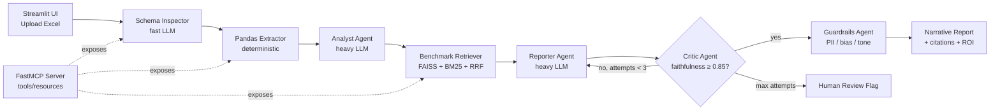

# Contact Center Copilot

> Multi-agent system that transforms contact center diagnostic data (Excel) into narrative reports with industry benchmarking, ROI scenarios, and citation-backed insights.

Built with **LangGraph** orchestration, **RAG** over industry benchmarks, **FastMCP** for tool exposure, and Pydantic-validated structured outputs.

[](https://github.com/sergeychernyakov/contact-center-copilot/actions)
[](https://www.python.org/downloads/)
[](https://opensource.org/licenses/MIT)

---

## What it does

Upload an Excel file with call center KPIs (FCR, AHT, CSAT, agent utilization, etc.) — get back a polished narrative report that:

1. **Extracts** the metrics that matter (skipping irrelevant sheets)
2. **Compares** them against industry benchmarks via RAG retrieval
3. **Quantifies** performance gaps and ROI scenarios
4. **Narrates** findings with inline citations to source benchmarks
5. **Self-corrects** through a Critic agent until faithfulness score ≥ 0.85

---

## Architecture



**Why LangGraph instead of LangChain chains?** The Critic→Reporter feedback loop requires cycles and state persistence. Chains are DAGs — they can't loop. LangGraph also gives us conditional edges, bounded retries, and built-in human-in-the-loop checkpoints.

**Why split deterministic extraction from LLM analysis?** LLMs hallucinate numbers. Pandas doesn't. By separating "what are the numbers" (pandas) from "what do they mean" (LLM), we eliminate a class of bugs that no amount of prompting can fix. See [Challenge 1](docs/challenge-1-hallucinations.md).

---

## LLM provider — swappable

The pipeline supports multiple LLM providers via a single env flag. Adding a new provider is one factory function in `src/agents/_llm.py`.

| Provider | Default | Free? | Used for |
|---|---|---|---|
| **Ollama** | ✅ active | ✅ fully local, no key | any pulled model, e.g. Qwen2.5 14B |
| **Groq** | optional | ✅ generous free tier | Llama 3.1 8B (fast), Llama 3.3 70B (heavy) |
| **Anthropic** | optional | ❌ paid | Claude Haiku 4.5, Claude Sonnet 4.6 |

Switch via `LLM_PROVIDER=ollama`, `LLM_PROVIDER=groq`, or `LLM_PROVIDER=anthropic` in `.env`. The default is **Ollama** — fully local, no API key — once you `brew install ollama` and `ollama pull qwen2.5:14b`. **Groq** is a fast hosted free-tier alternative.

> **Why Groq?** Inference on LPU chips is **300-800 tokens/sec** — narrative generation completes in 2-4 seconds rather than 15-20. For demo and iteration that's a huge UX win. For production with sensitive client data, Azure-hosted Claude or Azure OpenAI is the better choice — and the abstraction makes the swap trivial.

Get a free Groq key at https://console.groq.com (Google account, 1 minute).

---

## Tech stack

| Layer | Tool | Why |
|---|---|---|
| LLM (default) | Llama 3.3 70B / 3.1 8B via Groq | Free, very fast, OpenAI-compatible API |
| LLM (alt) | Claude Sonnet 4.6 + Haiku 4.5 via Anthropic | Higher quality, Pydantic-native structured output |
| Embeddings | `sentence-transformers` (local) | Zero external API deps, self-contained Docker |
| Vector store | FAISS | Local, fast, swappable to Azure AI Search via env config |
| Orchestration | LangGraph | State, cycles, conditional edges, HITL |
| Tool protocol | FastMCP | Standardized way to expose tools to external agents |
| Validation | Pydantic v2 | Structured outputs, no `json.loads` over LLM output |
| Evaluation | RAGAS + custom evaluators | Faithfulness, numeric accuracy, citation coverage |
| Observability | LangSmith | Per-agent traces, token cost, latency |
| UI | Streamlit | Fast prototyping, file upload, streaming |
| CI/CD | GitHub Actions | Lint, test, eval regression gates |
| Container | Docker + docker-compose | One-command local setup |

---

## Quick start

```bash
git clone https://github.com/sergeychernyakov/contact-center-copilot.git
cd contact-center-copilot

# 1. Configure
cp .env.example .env
# Default provider is Ollama (free, local): brew install ollama && ollama pull qwen2.5:14b
# Or set LLM_PROVIDER=groq in .env with a free key from console.groq.com

# 2a. Docker (recommended)
docker compose up

# 2b. Or local Python
python3.11 -m venv .venv
source .venv/bin/activate
pip install -e ".[dev,ollama]"
python scripts/generate_sample_data.py
streamlit run src/ui/streamlit_app.py
```

Open http://localhost:8501, upload `data/sample_diagnostic.xlsx`, click **Run Analysis**.

---

## Demo

📺 **3-minute walkthrough:** [demo.mp4](./demo.mp4)


The video shows:
- Excel upload and schema inspection (12 KPIs identified across 3 relevant sheets)
- Multi-agent pipeline streaming output to UI
- Final narrative report with inline citations
- LangSmith trace showing per-agent latency
- GitHub Actions CI run with regression gates

---

## Engineering challenges solved

The interesting part of any AI system is what breaks when you take it out of the tutorial environment. Five problems surfaced during this build — each documented with the failed attempts and the final architecture:

### [1. Hallucinated numbers in financial narratives](docs/challenge-1-hallucinations.md)
LLM invented an FCR of 73% when the source data said 68%. In a client-facing report, that's not a bug — that's liability. Fixed by splitting deterministic extraction (pandas → Pydantic) from narrative generation (LLM only fills prose around fixed numeric slots), plus a regex-based validator. **Numeric accuracy: 77% → 100%** on golden dataset of 50 reports.

### [2. Industry-specific RAG retrieval](docs/challenge-2-retrieval.md)
Banking client got benchmarks from retail call centers — semantically close, categorically wrong. Fixed with hybrid search (BM25 + dense), metadata pre-filtering on industry, and graceful fallback that flags cross-industry data in the narrative. **Relevance@5: 0.61 → 0.89**.

### [3. Excel files exceeding context window](docs/challenge-3-excel-scale.md)
Real client Excel: 47 sheets, 12k rows, 80+ columns. Couldn't fit. Naive truncation lost critical data. Per-sheet LLM calls cost $4 and took 8 minutes per report. Fixed with schema-first agent (fast LLM scans headers only) + pandas aggregation + analyst on compact MetricsSummary. **Latency: 8min → 14s.**

### [4. Self-correcting loops & cost control](docs/challenge-4-loop-control.md)
Critic and Reporter agents got into infinite back-and-forth — 15 iterations on a single report. Fixed with bounded retries, progressive threshold relaxation in Critic's prompt, full feedback history passed to Reporter, and HITL escalation node after 3 failed attempts. **Avg iterations: 4.2 → 1.8.**

### [5. Regression-proof evaluation pipeline](docs/challenge-5-eval.md)
Without eval, every prompt tweak is a coin flip. Built golden dataset (50 input/expected pairs), multi-dimensional metrics, and GitHub Actions regression gates that fail builds if any metric drops below threshold. **Caught 3 regressions before production.**

---

## What this POC deliberately doesn't do

Being honest about scope matters more than feature lists. This POC skips:

- **Authentication / multi-tenancy** — single-user demo, would need Azure AD + row-level security for production
- **Streaming long reports** — sync response only; in production, would use Server-Sent Events
- **Drift monitoring** — no detection for when industry benchmarks become stale
- **A/B testing of prompts** — manual prompt versioning in code, not via tool like Langfuse Prompts
- **Multi-language reports** — English only; LLM can do this trivially but eval set would need rebuilding
- **Database persistence** — runs in-memory; reports aren't saved between sessions

Each of these is a known trade-off, not an oversight. Happy to discuss the production roadmap.

---

## Repo structure

```
contact-center-copilot/
├── README.md
├── docs/
│   ├── architecture.md
│   ├── challenge-1-hallucinations.md
│   ├── challenge-2-retrieval.md
│   ├── challenge-3-excel-scale.md
│   ├── challenge-4-loop-control.md
│   └── challenge-5-eval.md
├── src/
│   ├── agents/              # Schema inspector, extractor, retriever, reporter, critic, guardrails
│   ├── graph/               # LangGraph state + workflow assembly
│   ├── rag/                 # Ingestion, hybrid retriever
│   ├── mcp_server/          # FastMCP server exposing tools
│   ├── tools/               # Excel extractor, ROI calculator
│   ├── ui/                  # Streamlit app
│   └── config/              # Pydantic Settings
├── tests/                   # pytest
├── eval/                    # golden_dataset + run_eval.py
├── data/
│   ├── sample_diagnostic.xlsx
│   └── benchmarks/          # Industry benchmark markdown chunks
├── reference/hackerrank_pwc/  # Original PwC screening code (for context)
├── .github/workflows/ci.yml
├── Dockerfile
├── docker-compose.yml
└── pyproject.toml
```

---

## Notes on AI assistance during development

This POC was built with Claude as a pair programmer. Architecture decisions, agent design, prompt engineering, failure analysis, and trade-off choices are mine; AI accelerated boilerplate and iteration speed. Each decision in the [docs/](./docs/) folder includes the reasoning, not just the outcome — that's the part that mattered.

---

## Author

Sergey Chernyakov · [LinkedIn](https://www.linkedin.com/in/sergey-chernyakov-458506400/) · Backend / AI Engineering Lead

Built in 7 days as a thought exercise for the **PwC AppDev Lead AI Engineer** role.

---

## License

MIT
