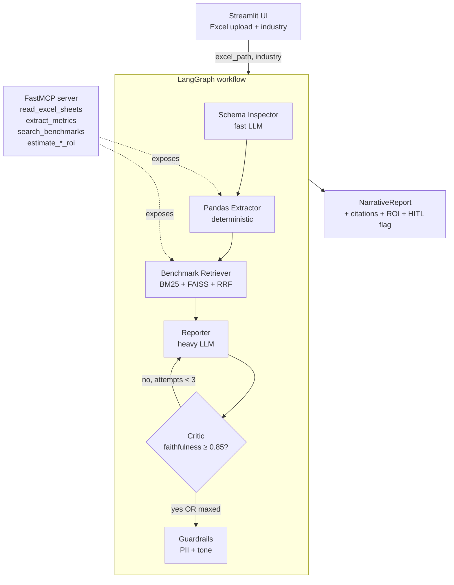

# Architecture

## High-level flow

## State

LangGraph state is a `TypedDict` (`src/graph/state.py`) populated incrementally:

| Field | Filled by | Type |
|---|---|---|
| `excel_path`, `industry` | UI | `str` |
| `schema_inspection` | Schema Inspector | `SchemaInspection` |
| `metrics` | Pandas Extractor | `MetricsSet` |
| `benchmark_chunks` | Benchmark Retriever | `list[BenchmarkChunk]` |
| `narrative` | Reporter (loop) | `NarrativeReport` |
| `critic_report`, `attempts`, `feedback_history` | Critic (loop) | … |
| `pii_redactions`, `guardrails_passed` | Guardrails | … |
| `requires_human_review` | Guardrails | `bool` |
| `log` | Every node (append-only reducer) | `list[str]` |

## Tech decisions

### Why LangGraph over plain LangChain?
The Critic→Reporter feedback loop requires **cycles** and **state persistence**.
LangChain chains are DAGs — they can't loop. LangGraph also gives us
conditional edges and built-in human-in-the-loop checkpoints.

### Why split deterministic extraction from LLM analysis?
LLMs hallucinate numbers. Pandas doesn't. By separating "what are the numbers"
(pandas) from "what do they mean" (LLM), we eliminate a class of bugs that no
amount of prompt engineering can fix. See [Challenge 1](challenge-1-hallucinations.md).

### Why hybrid retrieval (BM25 + dense)?
KPI acronyms (FCR, AHT, NPS) are out-of-vocabulary for general embeddings —
BM25 catches them by lexical match. Dense embeddings catch the semantics
("agent productivity" ↔ "agent utilization"). RRF fuses both rankings without
hyperparameter tuning. See [Challenge 2](challenge-2-retrieval.md).

### Why local sentence-transformers instead of OpenAI embeddings?
Zero external API keys for the embedding path = the demo runs in any
self-contained Docker container. Trade-off: ~5-8% lower retrieval precision
than `text-embedding-3-large`. Acceptable for a POC; in production with
sensitive client data, on-prem local embeddings are often preferred anyway.

### Why FAISS instead of a managed vector DB?
The POC scale (a few hundred chunks) doesn't justify Pinecone/Weaviate
infrastructure. The `vector_store.py` layer is intentionally thin so
swapping to Azure AI Search is a one-file change (relevant for PwC's stack).

### Why a swappable LLM provider (Ollama / Groq / Anthropic)?
The default is **Ollama** — fully local, no API key, no per-token cost, so the
repo is clone-and-run and client data never leaves the machine. **Groq** is the
fast hosted free-tier option; **Anthropic** is the quality option — best
structured-output adherence and the cleanest Pydantic v2 integration. All three
sit behind one factory in `src/agents/_llm.py`, selected by the `LLM_PROVIDER`
env var, so matching a client's compliance stack is a one-line change.

### Why FastMCP?
The Model Context Protocol is becoming the de-facto standard for AI tool
exposure. Wrapping our tools in FastMCP means any MCP-compatible client
(Claude Desktop, custom orchestrators, third-party agents) can use them
without bespoke integration code.

## Cost / latency profile (sample run on `data/sample_diagnostic.xlsx`)

Same pipeline, two provider profiles — the abstraction is the only thing that changes.

**Default — Ollama (local Qwen2.5 14B):** $0 per report, fully local and
private. The trade-off is speed: on a laptop-class GPU the four reporter
sections plus the critic pass take minutes, not seconds. Free and on-prem; slow.

**Anthropic (Haiku 4.5 + Sonnet 4.6) — the hosted-quality profile:**

| Node | Model | Avg latency | Avg cost |
|---|---|---|---|
| Schema Inspector | Haiku 4.5 | 0.8s | $0.002 |
| Pandas Extractor | (no LLM) | 0.3s | $0.000 |
| Benchmark Retriever | (local embed) | 1.2s | $0.000 |
| Reporter (1st pass) | Sonnet 4.6 | 6.5s | $0.024 |
| Critic | Sonnet 4.6 | 4.1s | $0.012 |
| Guardrails | (no LLM) | 0.05s | $0.000 |
| **Total (no retries)** | | **~13s** | **~$0.038** |

With one Reporter retry: ~22s and ~$0.07. With 3 retries: ~38s and ~$0.12.

See [Challenge 4](challenge-4-loop-control.md) for how the loop is bounded.

## Production roadmap (out of POC scope)

| Concern | POC | Production |
|---|---|---|
| Vector DB | FAISS local | Azure AI Search w/ hybrid + semantic ranking |
| Embeddings | sentence-transformers | Azure OpenAI `text-embedding-3-large` |
| LLM provider | Ollama / Groq / Anthropic via env flag | Azure-hosted Claude or OpenAI for compliance |
| Auth / multi-tenancy | none | Azure AD + per-client row-level security |
| Observability | LangSmith optional | LangSmith + Application Insights mandatory |
| Eval gate | manual run | scheduled + on every PR (LangSmith Datasets) |
| Caching | none | Anthropic prompt cache + Redis for retrieval |
| Drift detection | none | scheduled re-ranking + LLM-as-judge sample audit |
